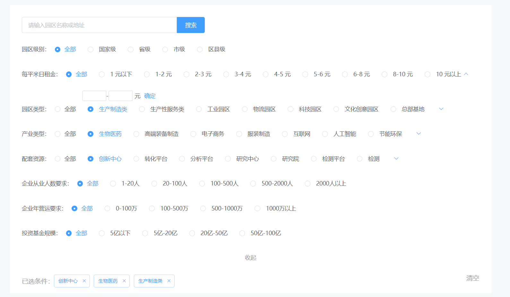

如果没有重大变化，我们就只看问卷答案。不会在语音面试前另外联络申请人。

--- 

# nriat 前端开发面试问卷。

- 在3天内尽量完成，如果时间安排有冲突，请告知完成时间
- 可以上网查资料，问问题，问人，但必须自己动手完成
- 测试题比实际项目代码容易
- 对问题有不确定的地方及时发邮件 dataChina（at）nriat.com
- 远程面试本身就是对远程工作能力的测试，请当成正常工作交流
- 答案请发回： 
  ```
  To: dataChina（at）nriat.com
  cc: luyao.zheng@nriat.com（at）nriat.com
  Subject: VUE开发面试问卷回复 （姓名，城市）
  ```

---


### 工作时间安排
- 周一至周五 9:00-18:00
- 非特殊情况上线赶节点不会加班


### 写在最前面的问题

- 未来2年有打算常住哪个城市？
- 如果将来的5年都在我们公司工作，对职位，收入，工作内容有什么期待？（最理想的状况）
- 团队会议时间外，平时的工作日打算怎么安排时间？
- 有什么想问的问题？

---

### 面试问题 1 - coding

1. 请从0开始构建一个个vue3或者react脚手架
   1. 请使用Typescript，scss
   2. 包含状态管理（ pinia ）、路由等基础功能
   3. UI控件请使用纯css/scss，不引入第三方UI框架
2. 使用脚手架实现下面的页面
   - 需求说明：
     - 按照设计稿实现所有的UI
       - 必须完成：筛选功能，已选筛选条件清除。
       - Filter选项和已选条件联动。
    - 筛选列表是前端自定的，但是选项是从后端获取的数据可自行mock。每一个筛选条件的选项都是不同的接口。
    - 任一筛选条件选中的时候，需要把选中的文字加载到已选条件中。如果该条件已经被选中，做更新操作。如果选中的是全部，从已选条件中移除该项。最终提交的数据是选项的value值。
    - 每一个筛选条件只能选中一个，默认为全部。选中全部的时候最后的筛选条件中该项为空
    - 租金筛选条件比较特殊，传给后端的数据需要手动从文字1-2元中 分割为两个字段、最低值：1，最高值：2。
    而且手动输入的功能，可以输入任意数字，但是不能输入负数。
   - 数据说明
    字典数据为以下结构:
    ```javascript
    // 租金
    [{
     value:0,
     label: '1元以下'
    },{
     value:1,
     label: '1-2元'
    }]
    ```


---

### 面试问题2  - pagespeed

页面速度有2方面的考虑：

- 用户体验
- SEO

慢的页面不但影响用户，也会影响SEO排名。以下列出了我们的网站和竞品

```
https://datacn.info
https://datausa.io/

```

1. 有哪些地方我们的网站做的不好，需要改善？
   1. 哪些问题是影响用户体验的，哪些是影响SEO的？    

2. 为了得到以上答案，使用了什么页面速度调试和报告工具？
   1. 为什么要使用这个（些）工具？    
   2. 不同的测试指标有什么意义？      

3. 需要怎样改善？


#### 答案格式

- 请尽量完整的介绍解决思路, 有可能的排查方向|手段, 如果使用到某些工具也请一并列出

---

### 面试问题 3

用vue.js，angular（或类似框架）开发的SPA，运行时发现浏览器报告内存使用过高。很多iPhone X，XS 用户反馈使用时间长了容易崩溃

- 怎样调试判断是否有内存泄漏？
- 如果是内存泄漏通过哪些手段修复？
- 如果不是内存泄漏怎么办？

*结合自己曾经解决的案例说明。

---

### 面试问题 4

有一个项目，需要进行多端开发（桌面端、移动端），采用同一套后端API，前端决定使用vue 的情况下，如果才能最大化的做到代码复用？ 业界有没有什么成熟的方案？ 


